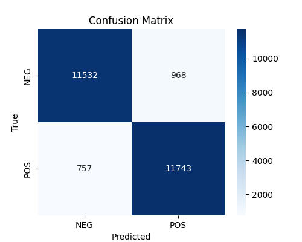

# Sentiment Classification with DistilBERT  

## Overview  
This is a straightforward sentiment classification project on the IMDb dataset.

Instead of using a canned solution, the repo includes a minimal but flexible setup:  
- a custom training loop (with gradient clipping, schedulers, loss tracking),  
- dataset-level predictions saved to CSV,  
- a few standard analysis tools (confusion matrix, ROC/AUC, probability calibration).

---

## Features  
- Custom training loop with gradient clipping and scheduler  
- Step-wise loss tracking and curve plotting  
- Dataset-level evaluation with metrics and plots  
- Misclassified sample inspection  
- Modular structure (training, evaluation, analysis separated)  

---

## Structure  

```
Text_classification/
├── src/
│   ├── trainer.py       # TextClassifier class 
│   ├── analysis.py      # metrics and plots
│
├── scripts/
│   ├── train.py         # training 
│   ├── evaluate.py      # evaluation 
│
├── notebooks/
│   └── showcase_results.ipynb       
│
├── plots/               
      


```

---

## Usage  

Train a model:  

```bash
python -m scripts.train
```

Evaluate on test set:

```bash
python -m scripts.evaluate
```
Check results in plots/ or open the demo notebook.

---

## Results 

- Accuracy ~93%
- ROC AUC ~0.96
- Usual pattern: confident on clear positives/negatives, shaky on mixed reviews.

### Confusion Matrix  
The confusion matrix below shows how predictions are distributed across the two classes:  

  
